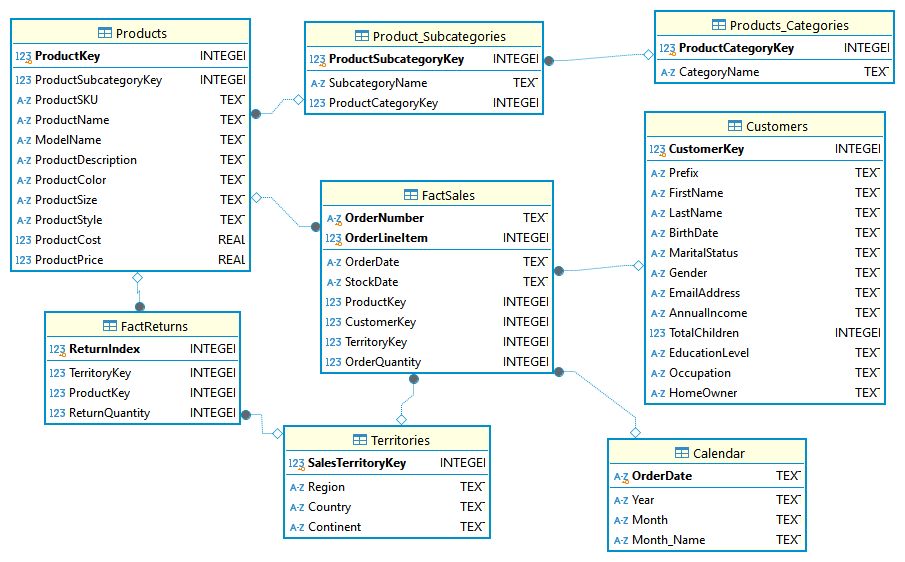

# **Adventure Works Analysis**
##  Overview

This project aims to perform an in-depth analysis of sales data, customer demographics, and product information to reveal intricate relationships and generate valuable insights. The goal is to help Adventure Works leverage these insights to craft more effective sales strategies, enhance product offerings, and design targeted marketing campaigns, bringing about sustained growth and improving customer satisfaction.

##  This project was broken into weekly tasks;

Week one focuses on Database Setup, importing of datasets, creating a data star schema by creating relationship keys between tables as well as initial data cleaning, thereby preparing the data for data analysis.

## Datasets Import
The datasets used for this project were CSV files which were stored on a Google Drive, and they were imported using DB Browser for SQLite.
The tables imported were sales (for 2015, 2016, and 2017), Rerturns, Product, Customer, Territory, Product, Product_Categories, Product_Subcategories.

## Database Schema Overview

### Fact Tables
#### 1. FactSales
Contains sales transactions data:

- OrderNumber: TEXT, Unique identifier for the order (Primary Key)
- OrderLineItem: INTEGER, Line item number within an order (Primary Key)
- ProductKey: INTEGER, Foreign Key to DimProducts.
- CustomerKey: INTEGER, Foreign Key to DimCustomers
- SalesTerritoryKey: INTEGER, Foreign Key to DimTerritories
- OrderDate: TEXT, Foreign Key to DimCalendar
- StockDate: TEXT
- OrderQuantity: INTEGER
#### 2. FactReturns
Contains product return information:

- ReturnIndex: INTEGER, Primary Key (AUTOINCREMENT)
- TerritoryKey: INTEGER, Foreign Key to DimTerritories
- ProductKey: INTEGER, Foreign Key to DimProducts
- ReturnQuantity: INTEGER, Number of products returned

### Dimension Tables

#### 1. Products
Contains product details: 

- ProductKey: INTEGER, Primary Key
- ProductSubcategoryKey: INTEGER
- ProductSKU: TEXT, Stock Keeping Unit
- ProductName: TEXT
- ModelName: TEXT
- ProductDescription: TEXT
- ProductColor: TEXT
- ProductSize: TEXT
- ProductStyle: TEXT
- ProductCost: REAL
- ProductPrice: REAL

#### 2. Customers
Stores customer details:

- CustomerKey: INTEGER, Primary Key
- Prefix: TEXT (e.g., Mr., Mrs.)
- FirstName: TEXT
- LastName: TEXT
- BirthDate: TEXT
- MaritalStatus: TEXT
- Gender: TEXT
- EmailAddress: TEXT
- AnnualIncom: REAL
- TotalChildren: INTEGER
- EducationLevel: TEXT
- Occupation: TEXT
- HomeOwner: TEXT
  
#### 3. Territories
Contains information about sales territories:

- SalesTerritoryKey: INTEGER, Primary Key
- Region: TEXT
- Country: TEXT
- Continent: TEXT
- OrderDate: TEXT

#### 4. Calendar
Stores date-related information for time-based analysis:

- Date: TEXT (Primary Key)
- Year: INTEGER
- Month: INTEGER

#### 5. Product_Categories
Contains product category information:

- ProductCategoryKey: INTEGER, Primary Key.
- CategoryName: TEXT

#### 6. Product_Subcategories
Contains detailed information about product subcategories:

- ProductSubcategoryKey: INTEGER, Primary Key
- SubcategoryName: TEXT
- ProductCategoryKey: INTEGER

### Foreign Key Relationships

- FactSales(ProductKey) → Products(ProductKey)
- FactSales(CustomerKey) → Customers(CustomerKey)
- FactSales(SalesTerritoryKey) → Territories(SalesTerritoryKey)
- FactSales(OrderDate) → Calendar(OrderDate)
- FactReturns(ProductKey) → Products(ProductKey)
- FactReturns(TerritoryKey) → Territories(SalesTerritoryKey)

DimProducts(ProductSubcategoryKey) → DimProductSubcategories(ProductSubcategoryKey)

DimProductSubcategories(ProductCategoryKey) → DimProductCategories(ProductCategoryKey)

This project defines a star schema for the AdventureWorks sales data. The Fact tables include sales and return records, while the Dimension tables contain data such as product information, calendar details, customer demographics, and territory data.

 

  
##

